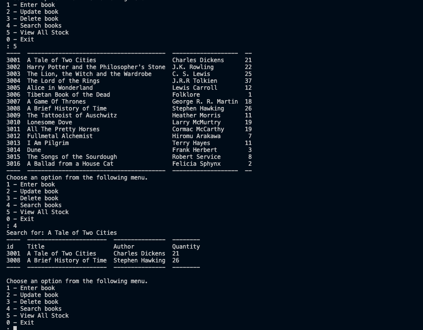

## Project Title: 
Bookstore Stock

## Description: 
This software allows a bookstore to view and manage its stock. It utilises Natural Language Processing for its search function. SQL, SQLite and of course python are used throughout the project. Upon running the project, the user will be given the following options.
* Enter book
* Update book 
* Delete book 
* Search books
* View All Stock 
* Exit

## Installation:
The software will run irrespective of whether data/ebookstore already exists. If it doesn't exist, the program will create the database and initialise it with stock. 

## Uses: 
A bookstore near you.

## Credits: 
Cormac Porter (MugillaGurilla)

