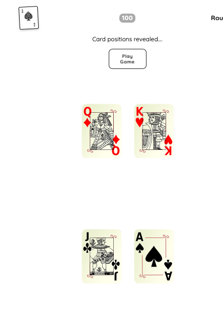
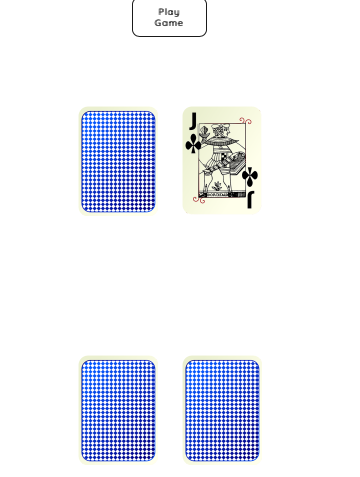

## Project Title: 
Hunt The Ace 

## Description: 
I made this game, following an online tutorial, because I love making games and wanted to learn Javascript. It's a simple enough game but incorporates many of the elements of online Javascript games such as 
* Dynamic CSS
* Save and resume functionalities
* Score evaluation and updating
* Basic animation
* Element creation, positioning 
* Grid creatio
* Adding classes


## Installation:
You can use any number of local servers to run this. I prefer either Live Server, from within VS Code, or, if you have node.js on your system, http-server. The appropriates commands to install http-server from terminal are...
``` nom install http-server ``` \
``` cd path/to/theproject ``` \
``` http-server ``` \

## Uses: 
Fun

## Credits: 
Cormac Porter (MugillaGurilla)


