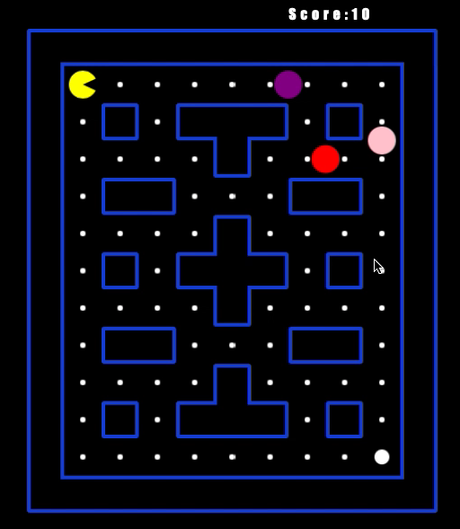

## Project Title: 
Pac-Man

## Description: 
I want to learn Javscript and I like making games so I made this game following an online tutorial. It's a relatively complex game that uses a lot of different elements.
* OOP, this was a particular focus of mine for this project. 
* Constructors, classes 
* Employing DRY
* AI for ghost movement
* Boundary creation and rendering using images
* Collision detection between boundaries and sprites (circle to rectangle)
* Collision detection between sprites and other sprites (circle to circle)
* Map creation and population
* Game Over, Win, Start Game, Pause, Resume and Start New Game functionalities
* Event listeners
* Good commenting, variable naming and code readability
* Move control, including gap anticipation systems
* Sprite rotation
* State changing for sprites (ghosts becoming 'scared')


## Installation:
You can use any number of local servers to run this. I prefer either Live Server, from within VS Code, or, if you have node.js on your system, http-server. Live Server can be downloaded from the Extensions part of VS Code while these are the appropriates commands to install http-server from terminal... \
``` npm install http-server ``` \
``` cd path/to/theproject ``` \
``` http-server ``` 

## Uses: 
Fun

## Credits: 
Cormac Porter (MugillaGurilla)

## Media: 
See the video and pictures for actions shots \


