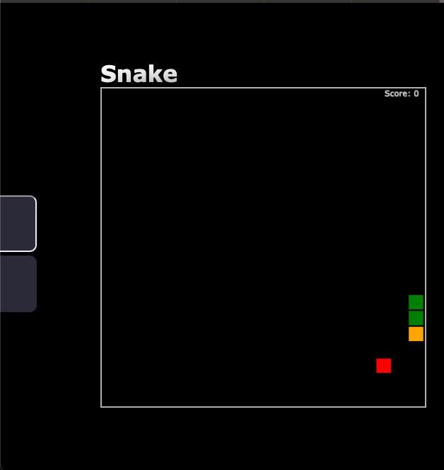

## Project Title: 
Snake

## Description: 
I made this game, following an online tutorial, because I love making games and want to learn Javascript. It's a simple enough game, based off the classic mobile game, but incorporates a lot of elements common to mobile games such as
* Collision detection
* Apple position randomisation
* Movement controls
* Adding classes
* Canvas creation
* Game Over, Start Game and Start New Game functionalities


## Installation:
It will work out of the box, just download the folder and open index.html in your preferred browser.

Alternatively, you can use any number of local servers to run this. I prefer either Live Server, from within VS Code, or, if you have node.js on your system, http-server. The appropriates commands to install http-server from terminal are... \
``` nom install http-server ``` \
``` cd path/to/theproject ``` \
``` http-server ``` 

## Uses: 
Fun

## Credits: 
Cormac Porter (MugillaGurilla)


