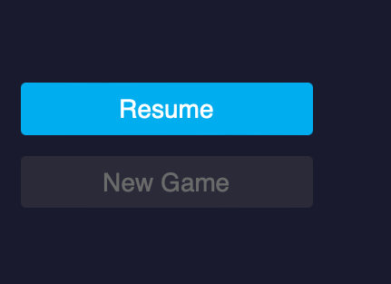
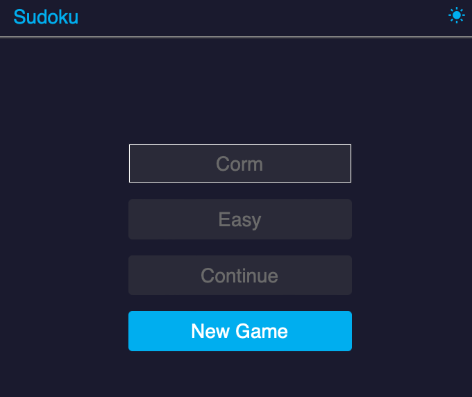
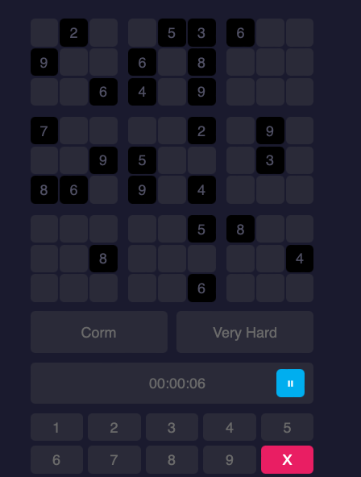

## Project Title: 
Sudoku

## Description: 
I want to learn Javscript and I like making games so I made this game following an online tutorial. It's a relatively complex game that uses a lot of different elements.
* Input evaluation
* Input prompting, error checking
* Dynamic CSS (try using Developer Tools on Chrome to set viewport dimensions to a phone screen size)
* Grid creation and population
* Grid clearing
* Adding and removing classes in order to navigate screens, or trigger animations
* Game Over, Win, Start Game, Pause, Resume and Start New Game functionalities
* Local save file storage and removal
* Event listeners
* Dark mode functionality (very very important)
* Sudoku numbers generation (manageable, but very difficult)
* Good commenting, variable naming and code readability


## Installation:
You can use any number of local servers to run this. I prefer either Live Server, from within VS Code, or, if you have node.js on your system, http-server. The appropriates commands to install http-server from terminal are... \
``` npm install http-server ``` \
``` cd path/to/theproject ``` \
``` http-server ``` 

## Uses: 
Fun

## Credits: 
Cormac Porter (MugillaGurilla)

## Media: 
See the video and pictures for actions shots



